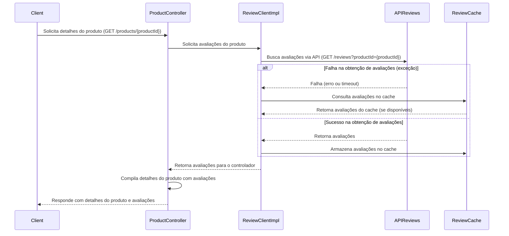

# circuit-breaker-spring-resilience4j

O projeto circuit-breaker-spring-resilience4j implementa, de forma básica para entendimento do conceito, o padrão de Circuit Breaker para aumentar a resiliência de sistemas distribuídos. Este padrão previne falhas em cascata ao interromper chamadas para microsserviços que demonstrem sinais de instabilidade, permitindo que eles se recuperem sem serem sobrecarregados por novas requisições.

### Serviços
- **Serviço de Produtos (products-service):** Responsável pela gestão e consulta de produtos. Este serviço inclui um endpoint que retorna detalhes de um produto específico juntamente com suas avaliações. Ele se comunica com o serviço de svaliações para obter essas informações.
- **Serviço de Avaliações (review-service):** Gerencia avaliações de produtos. É acessado pelo serviço de produtos para coletar avaliações relacionadas a um produto específico.

### Fluxo de chamadas e Circuit Breaker
Quando uma requisição é feita ao endpoint do produto para obter um produto com suas avaliações, o seguinte fluxo ocorre:

- O serviço de produtos consulta seu próprio repositório para obter detalhes do produto.
- Em seguida, faz uma chamada ao serviço de svaliações para obter as avaliações associadas.
- Se o serviço de svaliações estiver indisponível ou responder lentamente (esse cenário de timeout não foi implementado), o Circuit Breaker entra em ação, possivelmente abrindo o circuito para prevenir mais chamadas que falhariam.
- Se o circuito estiver aberto, o sistema tenta recuperar as avaliações do cache em memória como parte da estratégia de fallback.

O diagrama de estado inicial fornece uma visão geral dos estados do circuit breaker:

- **Estado Fechado (Closed):** Todas as chamadas externas são permitidas.

- **Estado Aberto (Open):** Chamadas externas são bloqueadas para permitir a recuperação do serviço.

- **Estado Meio Aberto (Half-Open):** Realiza chamadas limitadas para testar a estabilidade do serviço.

### Referências
[https://resilience4j.readme.io/](https://resilience4j.readme.io/)

[https://www.youtube.com/watch?v=LnOK32zvxVg&t=622s](https://www.youtube.com/watch?v=LnOK32zvxVg&t=622s)

[https://www.zup.com.br/blog/padroes-de-resiliencia-para-microsservicos](https://www.zup.com.br/blog/padroes-de-resiliencia-para-microsservicos)
