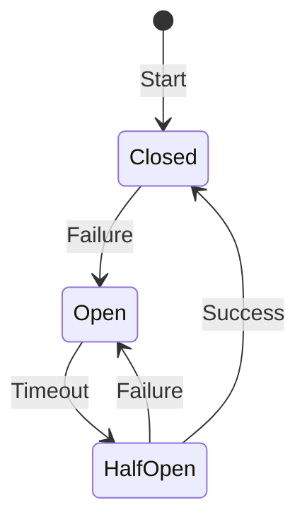

# circuit-breaker-spring-resilience4j

Circuit Breaker é um padrão de resiliência em sistemas distribuídos para evitar falhas em cascata.

#### Os 3 estados
- **Estado Fechado:** comunicação normal entre microsserviços.
- **Estado Aberto:** interrupção da comunicação quando um microsserviço está indisponível.
- **Estado Meio Aberto:** testes periódicos para verificar se o microsserviço recuperou sua funcionalidade.
